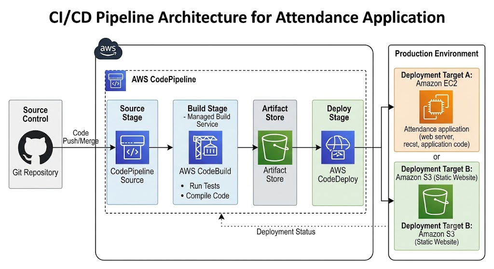
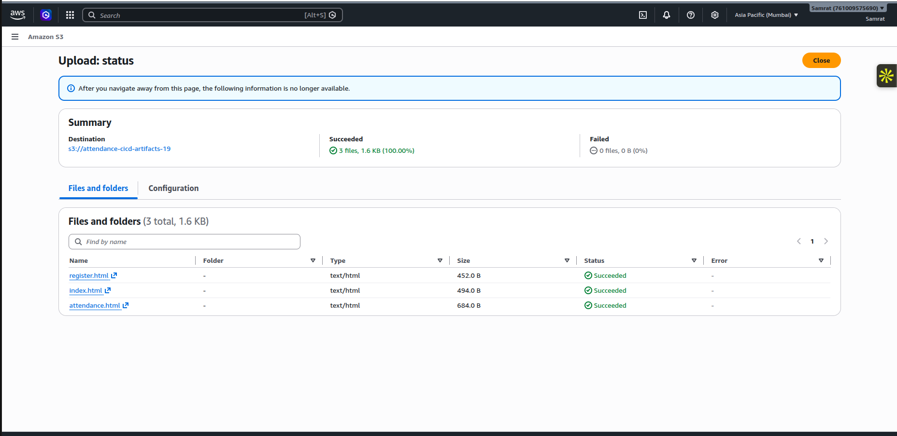
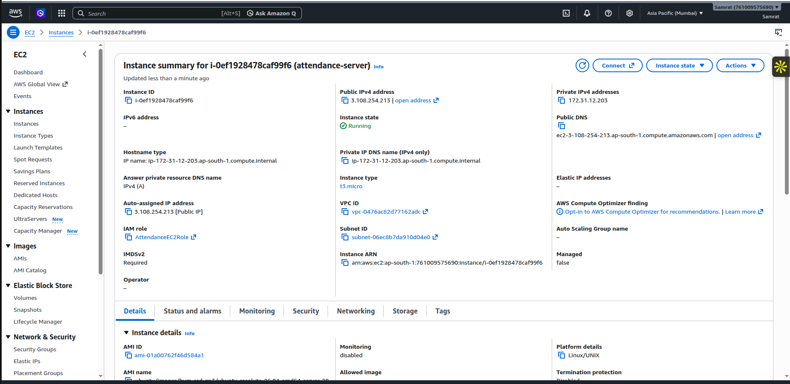
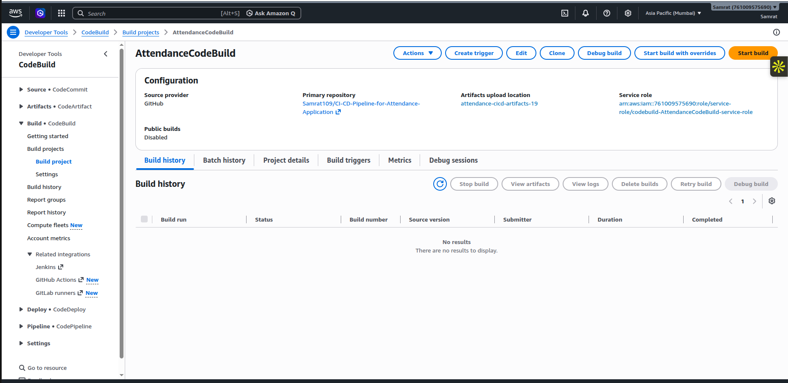

# Student Attendance Management System

A lightweight Flask application for managing student registrations and tracking daily attendance. This project is designed as a simple attendance system for classrooms, labs, or training sessions and is suitable for CI/CD pipeline practice.

## Features

- Register students with their name and roll number
- Mark attendance status for each student
- View the student list and attendance records from the home page
- Simple test suite to validate core functionality

## Tech Stack

- Python 3
- Flask
- Gunicorn
- Pytest

## Project Structure

- `app.py` - Main Flask application
- `templates/` - HTML pages for the web interface
- `tests/test_app.py` - Automated tests
- `requirements.txt` - Python dependencies
- `pytest.ini` - Pytest configuration

## Getting Started

1. Clone the repository
2. Create and activate a virtual environment
3. Install dependencies
4. Run the application

## Architecture


## Services
- S3(Simple Storage Service)
- EC2 (Elastic Compute Cloude)
-CodeBuild
-CodePipeline






### 1) Create a virtual environment

```bash
python -m venv .venv
source .venv/bin/activate
```

### 2) Install dependencies

```bash
pip install -r requirements.txt
```

### 3) Run the application

```bash
python app.py
```

The app will run on:

```text
http://localhost:5000
```

## Usage

- Open the home page to view registered students and attendance records
- Use the registration page to add new students
- Use the attendance page to mark a student as present, absent, or other relevant status

## Testing

Run the test suite with:

```bash
pytest
```

## Notes

This project is intentionally simple and can be extended with features like:

- persistent storage using SQLite or PostgreSQL
- authentication for admin access
- reporting and analytics for attendance trends
- Docker support for deployment


## Key Learnings
-Automated Source Integration: Developer code pushes or merges in the Git Repository serve as the primary trigger for the pipeline, which is ingested directly via the CodePipeline Source stage.   
-Managed Build and Test Process: AWS CodeBuild acts as the managed build service responsible for executing automated tests and compiling application code, ensuring quality before deployment.   
-Artifact Management: Intermediate build artifacts are securely stored in an Artifact Store (S3 bucket) to maintain build consistency between stages.   -Automated Deployment Management: AWS CodeDeploy automates the deployment phase by pulling artifacts from storage and deploying them to target environments.   
-Flexible Deployment Architecture: The architecture supports multiple targets depending on application components:   
                                Target A (Amazon EC2): Hosts dynamic application components (web server, backend logic, and application code).  
                                Target B (Amazon S3): Hosts static website assets.   
 -Feedback Loop Mechanism: A dedicated Deployment Status feedback loop monitors deployments and sends operational status back to the pipeline to enable tracking and rapid issue resolution.